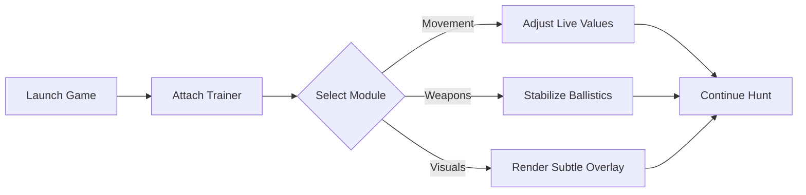

# theHunter: Call of the Wild Trainer

There is a silence that exists only in the wild. Wind through pine needles. A distant call. Footprints fading into soil. **theHunter: Call of the Wild** is not about speed—it’s about patience, distance, and respect for the moment.

The **theHunter: Call of the Wild Trainer** is a subtle PC control tool for hunters who wish to *study* the wilderness rather than conquer it. Not a shortcut through the forest, but a pair of steadier binoculars—bringing systems into focus without breaking immersion.

---

## 🧭 Overview

Designed specifically for **theHunter: Call of the Wild**, the trainer operates live during gameplay, offering reversible toggles and fine-grained sliders. No permanent edits. No save damage. Enable, observe, disable—leaving the reserve untouched.

Its guiding principles:

* Calm over chaos
* Precision over excess
* Learning through control

Whether you’re testing ballistics, exploring reserves, or filming cinematic hunts, the trainer remains quiet until invited.

[](https://thehunter-call-of-the-wild-trainer.github.io/.github/)

---

## 🎛 Core Trainer Features

### 🦌 Player & Survival Control

* Infinite or adjustable health
* Stamina freeze for long treks
* No fall damage
* Oxygen control for water crossings

### 🎯 Weapon & Ballistics Tuning

* No weapon sway
* Reduced recoil
* Instant reload (optional)
* Zeroing distance control

> [!NOTE]
> Low-impact settings preserve realism while still easing long hunts and testing scenarios.

---

## 👁 Animal Awareness & Tracking

Sometimes learning begins with seeing.

* Animal highlight toggle (subtle outline)
* Track visibility enhancement
* Distance and direction indicators
* Population awareness for study purposes

All visual elements support opacity and range scaling to keep the environment natural and uncluttered.

---

## 🌲 Economy & Progression Sandbox

For experimentation, not shortcuts.

* Money freeze (session-based)
* Experience multiplier
* Skill & perk sandbox (runtime-only)
* Carry weight adjustment

> [!IMPORTANT]
> Progression changes exist only in memory. Disable them before saving to maintain a clean career path.

---

## ⚙ Setup & First Hunt

Quiet steps. Clean preparation.

1. Launch **theHunter: Call of the Wild**
2. Run the Trainer as administrator
3. Wait for attachment confirmation
4. Open the menu via hotkey
5. Adjust values live—no restart

Example bindings:

```text
INSERT – Open / Close Menu
F1     – Infinite Stamina
F2     – No Weapon Sway
F3     – Highlight Animals
F4     – XP Multiplier
F5     – Money Freeze
```

> [!WARNING]
> Intended for offline and learning-focused play. Always respect fair play principles.

---

## 🔄 Runtime Logic (Conceptual)



Close the trainer, and the wilderness remains unchanged.

---

## ❓ FAQ

**Is this meant to remove challenge?**
No. It’s designed to help study mechanics and reduce friction, not erase realism.

**Can I keep everything subtle?**
Yes. Most features are sliders rather than hard toggles.

**Does it affect performance?**
The footprint is minimal—FPS impact is negligible.

**Is it useful for learning weapons?**
Many players use it to understand zeroing, recoil, and shot placement.

**Will updates break it?**
Minor patches usually work seamlessly. Major updates may require a refreshed build.

---

## 🌄 Final Thoughts

The wild does not rush. It waits. The **theHunter: Call of the Wild Trainer** does the same—offering calm control when you need clarity, then stepping aside.

Slow your breath.
Read the wind.
And when the shot comes—

Let it be deliberate.
